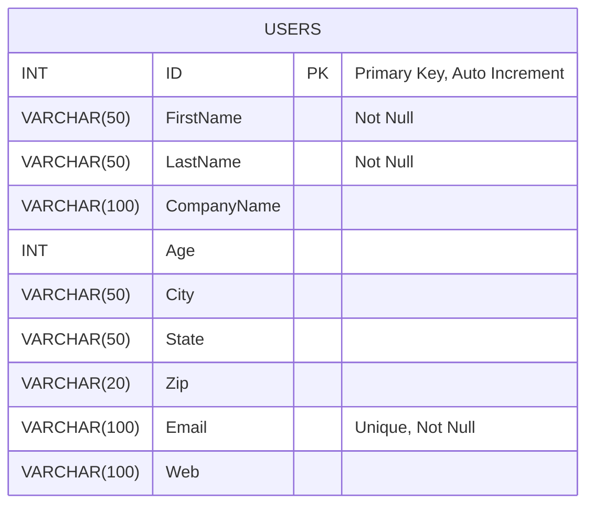

# FLASK APP

## Overview
This is a Flask Application that has API Endpoints to perform CRUD operations on User data that is stored locally.

## Features
- User management (Create, Read, Update, Delete)  # refer the User Model
- User search using partial names and cities with pages
- Get detailed summary of the users
- OpenAPI 3.0 Documentation for the end points
- Logging for debugging
- Functional Tests checking the APIs for code 200
- Pre-commit hooks and code quality tools (ruff, black)
- Self Contained dependencies with poetry
- Containerised for easy deployment.
- JWT Authentication using username and password.
- Rate-Limiters for end points.

## Prerequisites
Make sure you have the following installed:
- Docker

## Setup

### 1. Clone the Repository
```bash
git clone <url>
cd Flask-Assignment
```

### 2. Build the Docker Image
```bash
docker build -t <container_name> .
```

### 3. Start the Docker Container
```bash
docker container run -d -p 5000:<port> <container_name>
```
Note: If you don't want to detach the cli of the container, do not use ```-d```.
Use any port that you want to run the flask app on.

Check if Container has stared: (Only in detached mode/different terminal session)
```bash
docker container ls
```
Note down the first 4 characters of the container, as we will use it to access it.
It is used as ```<container_id>```

The flask server has started and is accessible at ```http://localhost:<port>```
The API Documentation can be found at ```http://localhost:<port>/apidocs```

### 4. Stopping the Docker Container:
```bash
docker stop <container_id>
```

## API Documentation
Once running, access API documentation at:
```
http://localhost:5000/apidocs
```

## Testing
When you are inside a docker's CLI, testing can be done using
```bash
cd App
pytest tests.py -v
```

## Schema of the User Table:


## Logging
Application logs has been created in ```app.log``` inside the docker container.

## Authentication
To use make changes to the database, you first need to login, this can be done by posting to http://127.0.0.1/login
Using the args: 
  * uid : "admin"
  * pass : "1243"

## Access Rate Limit
Access rate limit has been setup on the GET end points.
Default rate: 10 per hour


## Pre-Commit Hooks
Pre-Commit Hooks have been enabled along with black and ruff, which runs automatically when comitting.


## Afterwords
### How long did it take?
This project took me three nights to complete, as shown in the commit history.

### What was the most challenging?
Learning most of the tools used for the first time was the major hurdle. It was more time consuming than I had thought.
Learning these and then applying them took most of my time, which would be reflected by the slow commit rates, as I was 
also looking at the documentations and resources as I coded.


### What was unclear?
Most of what I had to do had been clearly instructed, I found no ambiguity.

### Any unexpected challenges?
The hardest part was documenting the API using OpenAPI, which took most of my last day.
I had not expected a documentation to take so much time.

### Is the difficulty appropriate?
Yes, the difficulty is appropriate. However given longer time, the final app and the tests could have been more thorough.

### Why the chosen tools?
Most of the tools chosen were for convenience and clear documentation to learn from.

### Any assumptions or decisions made?
Testing is only done for 200 response codes, as a very basic implementation.
