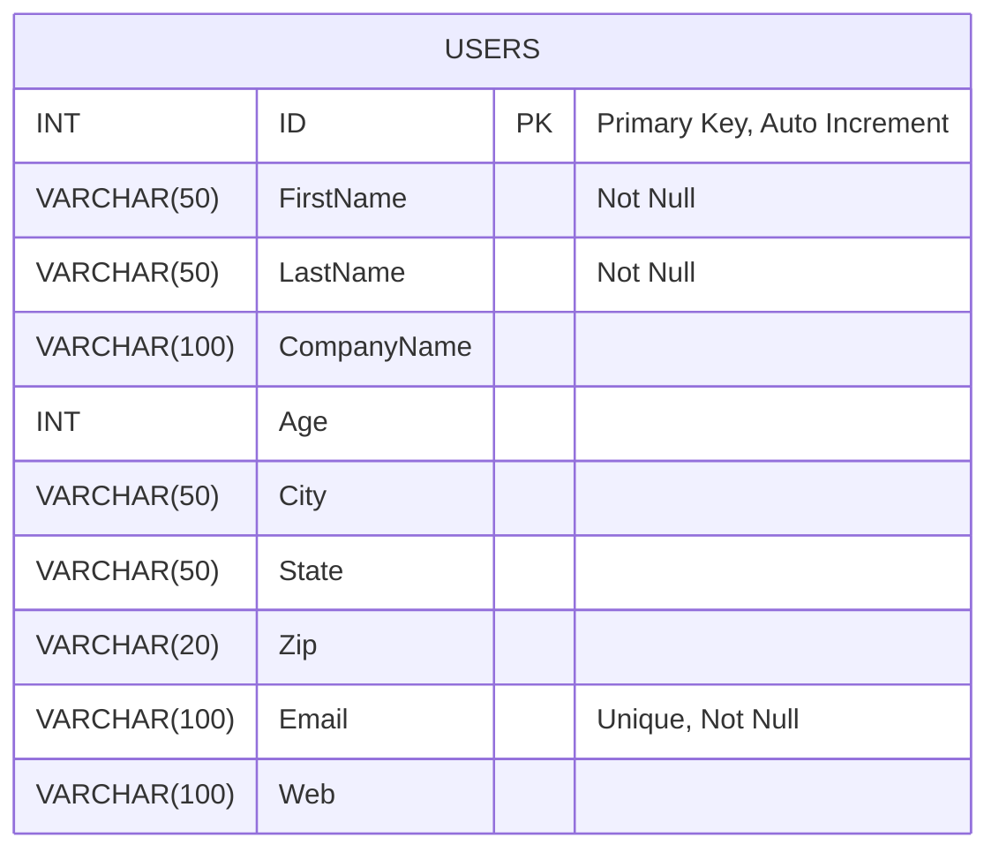

# FLASK APP

## Overview
This is a Flask Application that has API Endpoints to perform CRUD operations on User data that is stored locally.

## Features
- User management (Create, Read, Update, Delete)  # refer the User Model
- User search using partial names and cities with pages
- Get detailed summary of the users
- OpenAPI 3.0 Documentation for the end points
- Logging for debugging
- Functional Tests checking the APIs for code 200
- Pre-commit hooks and code quality tools (ruff, black)
- Self Contained dependencies with poetry
- Containerised for easy deployment.
- JWT Authentication using username and password.
- Rate-Limiters for end points.

## Prerequisites
Make sure you have the following installed:
- Docker

## Setup

### 1. Clone the Repository
```bash
git clone <url>
cd Flask-Assignment
```

### 2. Build the Docker Image
```bash
docker build -t <container_name> .
```


### 3. Start the Docker Container
```bash
docker container run -p 5000:<port_that_you_want_to_expose> <container_name>
```

Check if Container has stared:
```bash
docker container ls
```
Note down the first 4 characters of the container, as we will use it to access it.
It is used as <container_id>

### 4. Run Migrations
```bash
flask db upgrade
```

### 5. Start the Server
```bash
flask run
```

## API Documentation
Once running, access API documentation at:
```
http://127.0.0.1:5000/docs
```

## Testing
Run tests using:
```bash
pytest
```

## Code Quality Tools



## Logging
The application logs meaningful messages for debugging in `app.log`.
